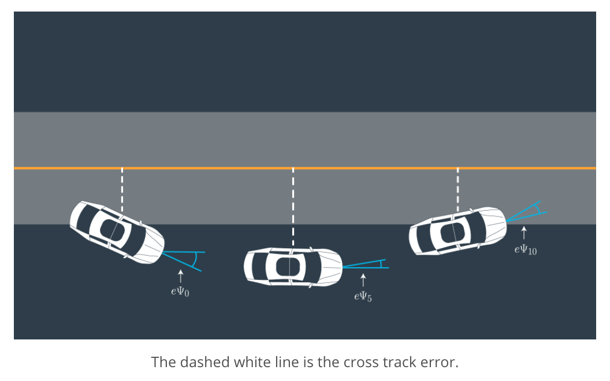
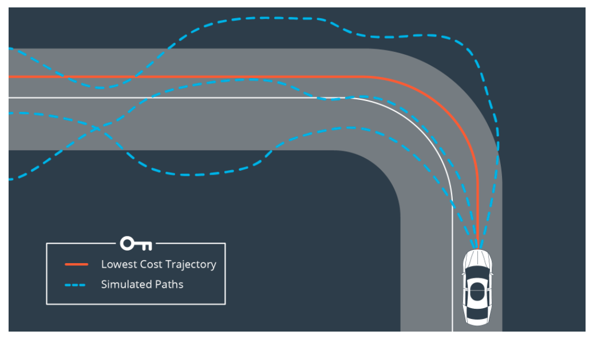

# Model Predictive Control project

## Introduction

In this project the goal was to apply model predictive control (MPC) to control a car around a race track, essentially controlling the steering and throttle.
In MPC the control problem is modeled as an optimization problem using the kinematics or dynamics model of the car as contraints for the kinematics parameters and physical limits such as maximum steering angle and acceleration/deceleration as bounds for our control input parameters steering and throttle. The optimizer is calculating a whole trajectory in each iteration and eventually chooses the one with the lowest cost. Every point on that trajectory consists with a vehicle kinematic state and control input / actuator values. Only the actuator value pair of the first point on the final trajectory is used as control input.
Because the project aims to be somewhat realistic there is an actuation latency of 100ms which has to be incorporated in the trajectory prediction.

The following screenshot of the simulator shows the MPC path displayed in green and the reference path in yellow:

[Picture]

## Setup - Dataflow with simulator
### Outputs from simulator
A simulator provides the following state variables as telemetry messages:
* X and Y Position of the car in a global map coordinate system
* Heading / yaw angle
* Lateral velocity 
* A list of waypoints in X and Y in a global map coordinate system

By fitting a polynomial to the given waypoints we get a function that resembles the curve of the road ahead.
Usually a 3rd degree polynomial can be a good estimate of most road curves. Before fitting the waypoints to the polynomial function we have to transform the global map coordinates into the local vehicle coordinate frame.

### Inputs to simulator
* List of reference trajectory waypoints in vehicle coordinate frame for visualization
* List of predicted waypoints by MPC in vehicle coordinate frame for visualization
* Control inputs: steering angle in rad [-25°, +25°], throttle [-1, +1]

## Model
For this project a Constant Turn Rate and Velocity (CTRV) vehicle model is assumed, that means our system states include:
* Position X and Y in an global map coordinate system
* Heading / yaw angle
* Lateral velocity 
* Cross track error (`cte`) - error between desired and the actual position.
* Orientation Error (`epsi`) - difference between our desired heading and actual heading.

The cross track error and orientation error (epsi) are illustrated in the following figure:


Once we fitted a polynomial function across the reference waypoints we can use it to calculate the errors `cte` and `epsi`.
The cross track error is caluclated by just evaluating the polynomial function at 0, whereas the heading angle error is the arctan of the derivative of the polynomial function, also evaluated at 0.
So to summarize:
* cte = f(0)
* epsi = argctan(f'(0))  


## Setting parameters

### MPC parameters

Different trajectories are calculated over the prediction horizon by the optimizer, the horizon is the duration over which future predictions are made. We’ll refer to this as time `T`.
* `T` is the product of two other variables, `N` and `dt`.
* `N` is the number of timesteps in the horizon.
* `dt` is how much time elapses between actuations.

For example, if `N` were `20` and `dt` were `0.5`, then `T` would be `10` seconds.
`N` and `dt` are hyperparameters which need to be tuned. But in general `T` should be as large as possible, while `dt` should be as small as possible.
Because of the actuation latency of `0.1` I also set `dt` also to `0.1`. It makes sense because due to the delay the timing grid at which the optimizer will get invoked will be at multiples of 0.1s anyway. Predicting trajectories with time steps smaller than this delay leads to shaky behaviour.
As for the number of timesteps `N` I stuck with the default value of 10, which just gave good results even at higher speeds like 100mph, so the prediction horizon was long enough for safe driving.

### Cost function design

The trajectory with the lowest cost will be chosen by the optimizer, that means that the cost function has to be designed carefully.



A cost function should contain all independed control variables which are actively changed by the optimizer, they are usually squared and added up to a scalar sum.
In my case I focussed only on penalizing steering actuations and the gaps between sequential actuations.
Because the weight for the cross track error term should be similar it got the same weight `steering_cost_weight`.

```c++
  for (int t = 0; t < N; t++) {
    fg[0] += steering_cost_weight * CppAD::pow(vars[cte_start + t], 2);
    fg[0] += CppAD::pow(vars[epsi_start + t], 2);
    fg[0] += CppAD::pow(vars[v_start + t] - ref_v, 2);
  }

  // Minimize the use of actuators, for all sampling points except last one (N-1).
  for (int t = 0; t < N - 1; t++) {
    fg[0] += steering_cost_weight * CppAD::pow(vars[delta_start + t], 2);
    fg[0] += CppAD::pow(vars[a_start + t], 2);
  }

  // Minimize the value gap (derivative) between sequential actuations,
  // for all sampling points except the last two (N-2).
  for (int t = 0; t < N - 2; t++) {
    fg[0] += steering_cost_weight * CppAD::pow((vars[delta_start + t + 1] - vars[delta_start + t]), 2);
    fg[0] += CppAD::pow(vars[a_start + t + 1] - vars[a_start + t], 2);
  }
```

For determining `steering_cost_weight` I used a heuristic that says that on straight roads (low curvature, high radius) the steering penalty should be relaxed and in narrow curves (high curvature, low radius) steering should get the main focus for the optimizer by setting a high weight, see here:

```c++
  const double max_radius = 1e3;
  // Calculate radius and catch division by zero
  if (fabs(coeffs[2]) > std::numeric_limits<double>::epsilon()) {
      // y(x)   = a*x^3 + b*x^2 + c*x + d
      // y'(x)  = 3*a*x^2 + 2*b*x + c,    y''(x) = 6*a*x + 2*b
      // coeffs = [d, c, b, a]
      // R(x)   = ((1 + f'(x)^2)^1.5) / abs(f''(x))
      //        = ((1 + (3*a*x^2 + 2*b*x +c)^2)^1.5 / abs(6*a*x+2*b)
      // R(0)   = ((1 + c^2)^1.5 / abs(2*b)
      radius = pow(1.0 + pow(coeffs[1], 2), 1.5) / fabs(2.*coeffs[2]);
      if (radius > max_radius)
        radius = max_radius;
  } else {
      radius = max_radius;
  }

  avg_radius(radius);
  steering_cost_weight = steering_smoothness * (max_radius / avg_radius);
```

The hyper parameter `steering_smoothness` was eventually set to `200`.


## Dependencies

* cmake >= 3.5
 * All OSes: [click here for installation instructions](https://cmake.org/install/)
* make >= 4.1(mac, linux), 3.81(Windows)
  * Linux: make is installed by default on most Linux distros
  * Mac: [install Xcode command line tools to get make](https://developer.apple.com/xcode/features/)
  * Windows: [Click here for installation instructions](http://gnuwin32.sourceforge.net/packages/make.htm)
* gcc/g++ >= 5.4
  * Linux: gcc / g++ is installed by default on most Linux distros
  * Mac: same deal as make - [install Xcode command line tools]((https://developer.apple.com/xcode/features/)
  * Windows: recommend using [MinGW](http://www.mingw.org/)
* [uWebSockets](https://github.com/uWebSockets/uWebSockets)
  * Run either `install-mac.sh` or `install-ubuntu.sh`.
  * If you install from source, checkout to commit `e94b6e1`, i.e.
    ```
    git clone https://github.com/uWebSockets/uWebSockets
    cd uWebSockets
    git checkout e94b6e1
    ```
    Some function signatures have changed in v0.14.x. See [this PR](https://github.com/udacity/CarND-MPC-Project/pull/3) for more details.

* **Ipopt and CppAD:** Please refer to [this document](https://github.com/udacity/CarND-MPC-Project/blob/master/install_Ipopt_CppAD.md) for installation instructions.
* [Eigen](http://eigen.tuxfamily.org/index.php?title=Main_Page). This is already part of the repo so you shouldn't have to worry about it.
* Simulator. You can download these from the [releases tab](https://github.com/udacity/self-driving-car-sim/releases).
* Not a dependency but read the [DATA.md](./DATA.md) for a description of the data sent back from the simulator.


## Basic Build Instructions

1. Clone this repo.
2. Make a build directory: `mkdir build && cd build`
3. Compile: `cmake .. && make`
4. Run it: `./mpc`.

## Tips

1. It's recommended to test the MPC on basic examples to see if your implementation behaves as desired. One possible example
is the vehicle starting offset of a straight line (reference). If the MPC implementation is correct, after some number of timesteps (not too many) it should find and track the reference line.
2. The `lake_track_waypoints.csv` file has the waypoints of the lake track. You could use this to fit polynomials and points and see of how well your model tracks curve. NOTE: This file might be not completely in sync with the simulator so your solution should NOT depend on it.
3. For visualization this C++ [matplotlib wrapper](https://github.com/lava/matplotlib-cpp) could be helpful.)
4.  Tips for setting up your environment are available [here](https://classroom.udacity.com/nanodegrees/nd013/parts/40f38239-66b6-46ec-ae68-03afd8a601c8/modules/0949fca6-b379-42af-a919-ee50aa304e6a/lessons/f758c44c-5e40-4e01-93b5-1a82aa4e044f/concepts/23d376c7-0195-4276-bdf0-e02f1f3c665d)
5. **VM Latency:** Some students have reported differences in behavior using VM's ostensibly a result of latency.  Please let us know if issues arise as a result of a VM environment.

## Editor Settings

We've purposefully kept editor configuration files out of this repo in order to
keep it as simple and environment agnostic as possible. However, we recommend
using the following settings:

* indent using spaces
* set tab width to 2 spaces (keeps the matrices in source code aligned)
